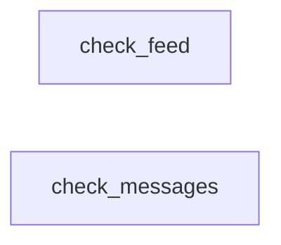
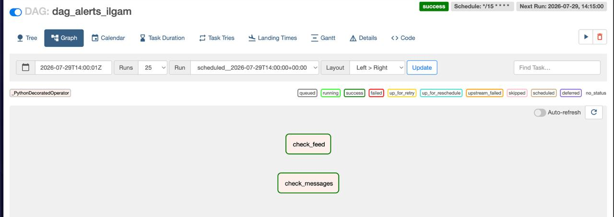
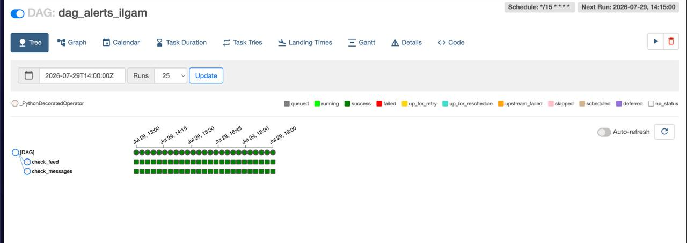
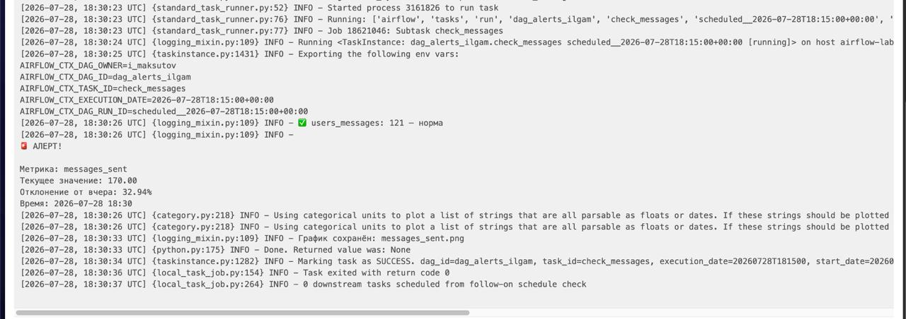
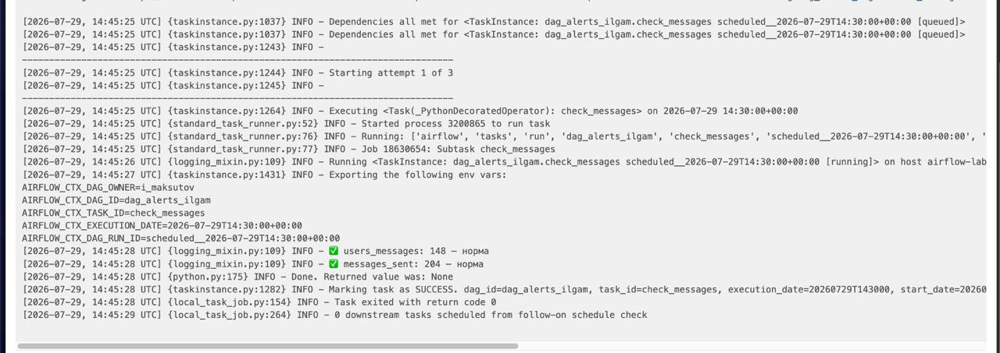

# 🚨 Alerts System: Airflow
 
## Описание
 
Автоматизированная система алертинга на Apache Airflow.
DAG запускается каждые 15 минут и проверяет 6 продуктовых
метрик на аномальные отклонения — по ленте и по мессенджеру.
 
---
 
## Метод детектирования
 
Текущее значение метрики (за последние 15 минут) сравнивается
со значением в **ту же 15-минутку сутки назад** — так учитывается
внутридневная сезонность (ночь vs день активности).
 
Отклонение считается симметрично — как отношение меньшего
значения к большему, чтобы рост и падение на одну и ту же
величину давали одинаковый процент отклонения:
 
```python
if current <= day_ago:
    diff = abs(current / day_ago - 1)
else:
    diff = abs(day_ago / current - 1)
```
 
Порог алерта: **30%**
 
---
 
## Архитектура
 

 
`check_feed` и `check_messages` выполняются независимо и
параллельно — каждый таск сам выгружает свои метрики из
ClickHouse, сравнивает с днём назад и решает, нужен ли алерт.
 
---
 
## Метрики
 
**Лента (check_feed):**
- DAU ленты (users_feed)
- Просмотры (views)
- Лайки (likes)
- CTR
**Мессенджер (check_messages):**
- DAU мессенджера (users_messages)
- Отправленные сообщения (messages_sent)
---
 
## Пример алерта в логах
 
```
🚨 АЛЕРТ!
Метрика: CTR
Текущее значение: 0.15
Отклонение от вчера: 34.20%
Время: 2026-07-29 14:15
📊 Дашборд: https://superset.lab.karpov.courses/superset/dashboard/8932/
```
 
Если метрика в норме:
 
```
✅ views: 12345.0000 — норма
```
 
---
 
## Визуализация
 
При срабатывании алерта дополнительно строится график
метрики (seaborn lineplot) — текущие сутки на фоне предыдущих,
для быстрого визуального сравнения. График сохраняется в буфер
(BytesIO) и подготовлен к отправке вложением в Telegram.
 
---
 
## Скриншоты
 
### Граф DAG

 
### История запусков

 
### Пример алерта в логах

 
### Пример метрики в норме

 
---
 
## Примечание
 
Алерты разработаны для отправки в Telegram-бот. В окружении
симулятора Карпова внешние подключения заблокированы —
результат выводится в логи Airflow через print(), а ссылка на
дашборд Superset добавлена в текст алерта для быстрого перехода
к расследованию причин.
 
Для запуска в продакшн окружении достаточно раскомментировать
отправку через `telegram.Bot` и передать `chat_id`/`token`.
 
---
 
## Расписание
 
Запускается каждые **15 минут**
(`schedule_interval='*/15 * * * *'`), `catchup=False` —
история не досчитывается задним числом.
 
---
 
## Стек
 
Python (pandas, pandahouse, seaborn, matplotlib),
Apache Airflow, ClickHouse, SQL
 
---
 
## Структура репозитория
 
```
alerts-system-airflow/
├── README.md
├── dag/
│   └── alerts_dag.py
└── screenshots/
    ├── dag_graph.jpg
    ├── dag_tree.jpg
    ├── logs_alert.jpg
    └── logs_normal.jpg
```
